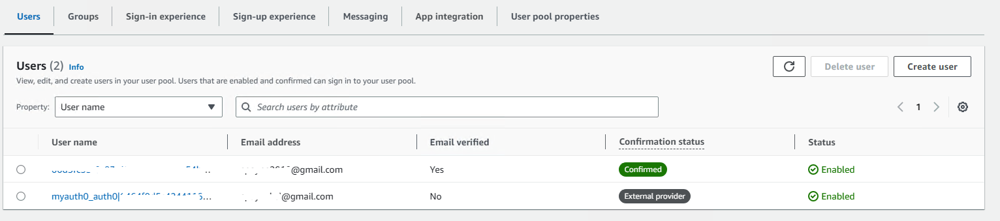

I have extended this demo to add SAML authentication and authorisation based on
https://repost.aws/knowledge-center/auth0-saml-cognito-user-pool

_The identity data has been redacted in the snippets below for security._

The app now has two users:
 - ********@gmail.com who signed up on Cognito's signup page
 - ********@gmail.com who had previously signed up with Auth0 and was granted access based on federated identity.
Because he was already signed in at Auth0, he wasn't prompted to sign in on my Cognito app.

Example JSON response:
``` 
code 2fd87414-244c-4a50-98bd-69251e48a12f
/oauth2/token {
  id_token: 'eyJraW...',
  access_token: 'eyJraW...',
  refresh_token: 'eyJjd...',
  expires_in: 3600,
  token_type: 'Bearer'
}
/oauth2/userInfo {
  sub: 'fddbbb69-0e6f-4e76-a3c4-709ff4c15144',
  email_verified: 'false',
  email: '********@gmail.com',
  username: 'myauth0_auth0|****************'
}
```

Decoded payload of `id_token`:
``` 
{
  "at_hash": "-Su0q18Je2tXOjiLMjK-0A",
  "sub": "fddbbb69-0e6f-4e76-a3c4-709ff4c15144",
  "cognito:groups": [
    "eu-west-2_********_MyAuth0"
  ],
  "email_verified": false,
  "iss": "https://cognito-idp.eu-west-2.amazonaws.com/eu-west-2_********",
  "cognito:username": "myauth0_auth0|********************************",
  "nonce": "UBi...",
  "origin_jti": "641...",
  "aud": "5jk3h9...",
  "identities": [
    {
      "userId": "auth0|********************",
      "providerName": "MyAuth0",
      "providerType": "SAML",
      "issuer": "urn:dev-************.uk.auth0.com",
      "primary": "true",
      "dateCreated": "1684424964106"
    }
  ],
  "token_use": "id",
  "auth_time": 1684424964,
  "exp": 1684428564,
  "iat": 1684424964,
  "jti": "70e99a03-c6b8-4d00-a055-881790d6b0fa",
  "email": "********@gmail.com"
}
```

AWS Cognito page:
